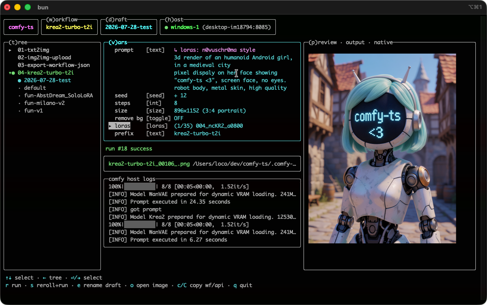

# comfy-ts

_the ultimate ComfyUI toolkit for TypeScript: `SDK` + `CLI` + `TUI` + `web panel` + agent guide_

[](https://github.com/rvion/comfy-ts/actions/workflows/ci.yml) [](https://www.npmjs.com/package/comfy-ts) [](https://www.npmjs.com/package/comfy-ts) [](https://github.com/rvion/comfy-ts/releases) [](https://www.npmjs.com/package/comfy-ts) [](https://github.com/rvion/comfy-ts/blob/main/LICENSE) [](https://github.com/sponsors/rvion)

**Everything ComfyUI, from TypeScript.** Build workflows in code with autocomplete on every node and model of your exact install. Run them on any host, from the box under your desk to a cloud GPU, and get the images straight back into your code. Drive them from a terminal UI with live latent previews, or from a browser panel that turns every workflow into a form — on your desk or on your phone. Let scripts and agents discover and install whatever the ecosystem offers. Import and export both ComfyUI JSON formats. One library, the whole pipeline.

**Jump to:** [⚡ 60 second start](#-60-second-start) · [🧩 SDK](#-the-sdk-workflows-as-code) · [🧬 Codegen](#-the-codegen-nothing-else-comes-close) · [🎛️ App mode & vars](#-app-mode--vars-knobs-on-everything) · [🖥️ TUI](#-the-tui) · [🌐 Web panel](#-the-web-panel) · [⌨️ CLI](#-the-cli) · [🌍 Comfy Cloud & hosts](#-hosts-local-lan-comfy-cloud-any-provider) · [🔌 Ecosystem](#-ecosystem-discovery-and-install) · [🤖 Agents](#-for-ai-agents) · [📚 Examples](#-examples) · [🧱 Trust](#-a-lib-you-can-trust-made-to-last)

## What's inside

| piece            | what it gives you                                                                        |
| ---------------- | ---------------------------------------------------------------------------------------- |
| 🧩 **the SDK**      | build and run workflows in code, typed down to the model names of your exact machine      |
| ⌨️ **the CLI**      | one command codegens a full typed SDK for any host, local or remote cloud                 |
| 🖥️ **the TUI**      | drive every workflow from the terminal: knobs, drafts, queue, live latent previews        |
| 🌐 **the web panel** | the same workflows as a browser form, phone included, with an LLM prompt refiner built in |
| 🤖 **agent tools**  | typed discovery and install across the whole custom node ecosystem, built for automation  |
| 🔁 **JSON, both ways** | import and export `api.json` and `workflow.json`, drag your code onto the Comfy canvas |

## ⚡ 60 second start

```bash
bun add comfy-ts     # or npm / pnpm / yarn
```

```ts
// myFirstWorkflow.ts
import { ComfyTS } from 'comfy-ts'

const comfy = ComfyTS.create()
const host = comfy.host({ id: 'my-gpu', host: '127.0.0.1', port: 8188 })
await host.connect() // fetches the schema, writes your typed SDK

const txt2img = host.defineWorkflow({
   id: 'txt2img', // names the saved outputs (and the TUI tree entry)
   vars: {},
   build: (b) => {
      // b is typed: autocomplete on EVERY node of THIS host
      const ckpt = b.CheckpointLoaderSimple({ ckpt_name: 'SD1.5\\v1-5-pruned-emaonly.ckpt' })
      const samples = b.KSampler({
         model: ckpt,
         positive: b.CLIPTextEncode({ clip: ckpt, text: 'a cozy house in a snowy forest' }),
         negative: b.CLIPTextEncode({ clip: ckpt, text: 'blurry, low quality' }),
         latent_image: b.EmptyLatentImage({ width: 512, height: 512, batch_size: 1 }),
         seed: 42, steps: 20, cfg: 7,
         sampler_name: 'euler', scheduler: 'normal', denoise: 1,
      })
      // streams the image back over the websocket — nothing saved on the server
      b.SaveImageWebsocket({ images: b.VAEDecode({ samples, vae: ckpt }) })
   },
})

const execution = await txt2img.run({ log: true, save: true }) // ▶ [██████░░] 71% · KSampler · 10s
for (const img of execution.images) console.log(img.absPath) // saved outputs
host.disconnect()
```

```sh
$ bun myFirstWorkflow.ts
▶ [████████████████] 100% · SaveImageWebsocket · 12s
.comfy-ts/outputs/txt2img_20260731-142012.png
```

Drop `save: true` and the outputs never touch a disk at all — `img.buffer` holds the bytes in memory ("Ephemeral outputs" below).

One tsconfig line activates the generated types:

```jsonc
{ "include": ["src", ".comfy-ts/hosts/**/sdk.d.ts"] }
```

No codegen yet? Everything still compiles on permissive base types, and sharpens the moment the generated sdk lands. Runs under Bun and node ≥ 20, dual ESM/CJS.

## 🧩 The SDK: workflows as code

The best embedded DSL we know how to build, distilled from years of writing typed DSLs in TypeScript. Fast inference, clever tricks, zero ceremony. Wrong workflow? Compile error, before ComfyUI ever sees the graph. Writing workflows in code gets so comfortable you may catch yourself experimenting here rather than in the visual editor. The tricks this section showcases:

- [Pass the node, skip the slot](#pass-the-node-skip-the-slot)
- [Nested or flat, your call](#nested-or-flat-your-call)
- [Lambda inputs: autocomplete only what fits](#lambda-inputs-autocomplete-only-what-fits)
- [auto(): let the graph wire itself](#auto-let-the-graph-wire-itself)
- [Content-addressed uploads](#content-addressed-uploads)
- [Problems, not crashes](#problems-not-crashes)

Wondering how any of this can exist? It all rests on [the codegen](#-the-codegen-nothing-else-comes-close) below.

### Pass the node, skip the slot

When a node has exactly ONE output of the expected type, pass the node itself:

```ts
const ckpt = b.CheckpointLoaderSimple({ ckpt_name: 'SD1.5\\v1-5-pruned-emaonly.ckpt' })
const samples = b.KSampler({ model: ckpt /* … */ }) // instead of model: ckpt._MODEL
b.VAEDecode({ samples, vae: ckpt })                 // same ckpt node, VAE output this time
```

`ckpt` carries one MODEL, one CLIP and one VAE output, so it slots into all three kinds of inputs directly, and refuses inputs it cannot feed.

### Nested or flat, your call

The same graph writes flat (a const per node) or nested (the code shaped like the graph). Mix freely; nested is often the practical form for small branches:

```ts
// flat
const latent = b.EmptyLatentImage({ width: 512, height: 512, batch_size: 1 })
const samples = b.KSampler({ latent_image: latent /* … */ })
b.SaveImage({ images: b.VAEDecode({ samples, vae: ckpt }) })

// nested
b.SaveImage({
   images: b.VAEDecode({
      samples: b.KSampler({
         latent_image: b.EmptyLatentImage({ width: 512, height: 512, batch_size: 1 }),
         /* … */
      }),
      vae: ckpt,
   }),
})
```

### Lambda inputs: autocomplete only what fits

Any input accepts a lambda. Its parameter is the builder NARROWED to the nodes able to produce the expected type, so autocomplete proposes only what can actually plug in:

```ts
b.KSampler({
   // n lists ONLY conditioning producers: CLIPTextEncode and friends
   positive: (n) => n.CLIPTextEncode({ clip: ckpt, text: 'a cozy house' }),
   /* … */
})
```

### auto(): let the graph wire itself

Leave a slot blank and comfy-ts wires the most recent node producing the right type:

```ts
import { auto } from 'comfy-ts'

const samples = b.KSampler({ latent_image: auto() /* picks the latest LATENT producer */ })
```

Handy in quick scripts; prefer explicit wiring in code meant to be read.

### Content-addressed uploads

Uploads are hash-named and deduped against the host before any byte moves. Run the same img2img a hundred times, the input image travels once:

```ts
build: async (b, vars, wf) => {
   const img = new MediaImage({ path: asAbsolutePath(vars.image) })
   const loaded = await img.loadInWorkflow_viaLoadImageNode(wf) // hash-named, deduped
   b.KSampler({ latent_image: b.VAEEncode({ pixels: loaded, vae: ckpt }) /* … */ })
}
```

### Problems, not crashes

Invalid graphs accumulate precise messages in `workflow.problems` before ComfyUI ever sees them: missing required inputs, type mismatches, each named with the node and field.

## 🧬 The codegen: nothing else comes close

Not "a ComfyUI type package" someone published once. One command reads YOUR host and writes a full SDK for it:

```bash
bunx comfy-ts gen --id my-gpu --host http://127.0.0.1:8188
# → .comfy-ts/hosts/my-gpu/{object_info.json, embeddings.json, sdk.d.ts}
```

```ts
declare global {
   namespace Comfy {
      namespace MyGpu {          // ← generated from THIS host
         interface Builder { … } //   one factory per node
         interface Union { … }   //   every enum: model names, samplers, loras, …
      }
   }
}
```

- **Literal types from the actual install.** `ckpt_name` only accepts checkpoints that machine really has; samplers, schedulers, loras and embeddings are unions of the real values.
- **Custom nodes are first-class.** Every installed pack lands in the builder: `b['rmbg.RMBG']` autocompletes like any core node.
- **One namespace per host, many hosts per codebase.** A workflow written against `my-gpu` cannot silently reference a model that only exists on `my-laptop`.
- **Never blocking.** Before the first codegen everything compiles on permissive base types, and sharpens the moment the generated sdk lands.
- **Browsable.** The generated file is real TypeScript; `bunx comfy-ts outline` shows it section by section.
- **See it for real: the Comfy Cloud catalog.** [`examples/comfy-cloud/sdk.d.ts`](examples/comfy-cloud/sdk.d.ts) is a full generated SDK for [Comfy Cloud](https://cloud.comfy.org) (5.9MB, 3574 nodes), committed so you can browse it and typecheck graphs against it without any host. [`examples/rvion/05-comfy-cloud.cflow.ts`](examples/rvion/05-comfy-cloud.cflow.ts) runs against it live: `url` + `apiKey` host config, one env var, images back in seconds.

## 🎛️ App mode & vars: knobs on everything

Vars turn a workflow module into a small APP: declare the tweakable parts once (`import { v } from 'comfy-ts'`) and `build` re-executes with current values on every `run()`. The TUI renders vars as its UI, scripts set them programmatically, drafts snapshot them. One module, many setups, re-runnable forever instead of a one-shot script.

```ts
export const txt2img = host.defineWorkflow({
   id: 'txt2img',
   vars: {
      prompt: v.text('a cozy house in a snowy forest, warm windows'),
      seed: v.seed(42),
      steps: v.int(20, { min: 1, max: 60 }),
      size: v.size({ width: 512, height: 512 }),
   },
   build: (b, vars) => { /* same graph, reading vars.* */ },
})

await txt2img.run({ log: true })
txt2img.vars.seed.randomize()
await txt2img.run({ log: true }) // fresh graph, fresh image
```

| var kind                | superpower                                                                        |
| ----------------------- | --------------------------------------------------------------------------------- |
| `v.seed`                | mode + number (`+ N` `- N` `= N` `? N`), advances itself: queued runs differ. `v.seed(42, { mode: '+' })` declares the mode |
| `v.prompt`              | structured text: `//` comments stripped, `- ` lines become the negative prompt     |
| `v.loras`               | RegExp resolved against the host's REAL lora list, fully typed, multi-select       |
| `v.image`               | local image path, TUI picker attached; `exampleImagePath('bear_1024x1024.jpg')` defaults to a bundled sample |
| `v.text` `v.int` `v.float` `v.toggle` `v.choice` `v.size` | the everyday knobs, ranges included          |
| `presets` on `v.text` / `v.prompt` | named starting texts (`{ 'terse tags': '…' }`): a presets button in the web panel, `P` in the TUI. Picking one replaces the field |

`vars` can be a lambda receiving `v` so vars reference each other: `v.prompt('a cozy house', { loraKeywordsFrom: loras })` prefixes the active loras' trigger keywords. Name the file `*.cflow.ts` and the TUI finds it.

## 🕶️ Ephemeral outputs: leave no traces

Some images should not outlive the run — client work, private subjects, anything you would not leave in a shared server's `output/` folder. ComfyUI has three image savers, and they differ exactly there:

| saver                | where the image lands server-side                  | how long it stays              |
| -------------------- | -------------------------------------------------- | ------------------------------ |
| `SaveImage`          | `output/` dir, workflow JSON embedded in the PNG   | forever (no delete API)        |
| `PreviewImage`       | `temp/` dir                                        | until the server restarts      |
| `SaveImageWebsocket` | nowhere — streamed back as binary ws frames        | never touches the server disk  |

comfy-ts treats `SaveImageWebsocket` as a first-class output: its frames land in `execution.images` like any other output, and **local saving is opt-in** — without `save`, the images exist only in memory (`img.buffer`, `img.getAsBlob()`, `img.getBase64Url()`; `img.absPath` is null):

```ts
// zero disk, end to end: nothing on the server, nothing locally
const execution = await txt2img.run({ log: true })
const bytes = execution.images[0]?.buffer

// opt-in local save, grouped in a subfolder
await txt2img.run({ log: true, save: { prefix: 'my-project' } })
```

Every combination is a valid choice — you pick where the image lives. `execution.images` works in all four (the bytes always stream to memory):

| graph saver          | `save` option | server disk | local disk |
| -------------------- | ------------- | ----------- | ---------- |
| `SaveImage`          | none          | yes         | no         |
| `SaveImage`          | `save: …`     | yes         | yes        |
| `SaveImageWebsocket` | none          | no          | no         |
| `SaveImageWebsocket` | `save: …`     | no          | yes        |

Running comfy-ts on the same machine as ComfyUI? Then row one is the best of both worlds: `SaveImage` with no `save:` writes the file exactly once, by the server, and it is already local — read it straight from ComfyUI's own `output/` folder.

Running an imported workflow or template that uses `SaveImage`? `ephemeral: true` rewrites its save nodes to `SaveImageWebsocket` in the sent prompt (the graph you authored stays untouched) and deletes the run's server history entry afterwards — the history holds your full workflow, prompts included:

```ts
await workflow.run({ ephemeral: true }) // implies scrubHistory: true
await host.clearHistory()               // or wipe the server's whole history
```

Honest limits, so you can decide what to trust:

- **uploaded inputs persist**: `/upload/image` files stay in the server's `input/` dir (ComfyUI has no delete API). If the host has a base64 loader node installed (`ETN_LoadImageBase64` from comfyui-tooling-nodes, or ComfyUI-Easy-Use's `easy loadImageBase64`), `mediaImage.loadInWorkflow_viaBase64Node(wf)` inlines the image into the prompt instead — no server file, and `scrubHistory` erases the prompt after. Comfy Cloud ships neither, so cloud inputs currently must ride uploads.
- **video/audio have no websocket saver** upstream: `SaveVideo` / `SaveAudio*` outputs persist on the host.
- **out of our reach**: server logs, RAM, crash dumps, reverse proxies, and a cloud provider's own retention policy. Ephemeral mode controls what the ComfyUI API persists — nothing more, and we won't pretend otherwise.

Every image example in `examples/` uses `SaveImageWebsocket`.

## 🖥️ The TUI



```bash
bunx comfy-ts tui
```

No argument needed: it finds every `*.cflow.ts` under your project AND the examples bundled with the package, so the first launch is never empty. Pass a folder or a module to scan just that. Keyboard-first, a persistent keybar showing every available key.

| panel        | what it does                                                                     |
| ------------ | -------------------------------------------------------------------------------- |
| **(t)ree**   | every `*.cflow.ts` found, with named drafts (var snapshots) nested under it       |
| **(v)ars**   | edit every knob: inline numbers, real multiline editor, fuzzy pickers, lora overlay with per-lora strengths |
| **(p)review** | LIVE latent previews mid-run, then the final image, painted REAL on kitty/Ghostty/iTerm2/WezTerm/VS Code |
| **(h)ost**   | node/lora/embedding counts, live queue, re-codegen, restart Comfy, interrupt      |

`r` runs, `s` rerolls the seed and runs, `o` opens the output, `c`/`C` copy workflow.json / api.json. Press `r` mid-run and it QUEUES with the values as they are right now. Drafts autosave: reopening lands you where you left off. Image vars open a full picker: browse the disk, favorite folders, recent picks, live preview of the highlighted image in the preview panel.

## ⌨️ The CLI

```bash
bunx comfy-ts gen --id my-gpu --host http://127.0.0.1:8188
# → .comfy-ts/hosts/my-gpu/{object_info.json, embeddings.json, sdk.d.ts}

bunx comfy-ts outline              # what's inside that 2MB sdk.d.ts?
bunx comfy-ts loras                # mirror your loras' names + trigger words (below)
bunx comfy-ts tui                  # your *.cflow.ts + bundled examples
bunx comfy-ts tui [dir | module]   # scan just that
bunx comfy-ts serve [dir | module] # drafts as a local HTTP API (below)
```

Any reachable host: the box under your desk or a GPU machine across the network, same command, same output.

### Loras with names, not file names

ComfyUI only tells you a lora's file name. If your host runs the [ComfyUI-Lora-Manager](https://github.com/willmiao/ComfyUI-Lora-Manager) extension, one command mirrors what it knows into your project:

```bash
bunx comfy-ts loras --id my-gpu --host http://127.0.0.1:8188
# → .comfy-ts/hosts/my-gpu/loras.json  (model names, civitai trigger words, tags, base models, previews)
bunx comfy-ts loras                # refresh later: id and url are remembered
```

After that, in the TUI's loras overlay you can type `aurora ink` to find `styles\aurora-ink-v3.safetensors`, and a lora's civitai trigger words are prefixed onto your `v.prompt` automatically when it is active (⌃K still overrides any lora's keyword by hand). No extension, or no sync yet? Everything behaves as before — file names and hand-typed keywords.

## 🌐 Serve: drafts as an HTTP API

Hand-tune a draft in the TUI, then make it callable by anything that speaks HTTP — a web frontend, curl, n8n, another service:

```bash
bunx comfy-ts serve                     # every *.cflow.ts under cwd, port 8288
bunx comfy-ts serve ./flows             # just that folder
bunx comfy-ts serve txt2img.cflow.ts    # one workflow (routes shorten to /generate/<draft>)
bunx comfy-ts serve --port 9000 --host 0.0.0.0   # pick port / reach it from your phone or tailnet
```

Bound beyond localhost, the startup print lists every URL the box answers on (LAN and tailnet), so the web UI is one tap away on another device. There is no auth: only do this on a network you trust. A browser page on any origin may call it, which is what lets `comfy-ts/web` use serve as its bridge; with no auth, that also means a page you visit can reach the API on your own machine. The launch screen says so every time.

Discover what's being served — same info the startup print shows, as JSON:

```bash
curl http://127.0.0.1:8288/drafts                  # all workflows, their drafts, every var described
curl http://127.0.0.1:8288/drafts/txt2img/moody    # one draft with its stored values
```

Generate:

```bash
curl -X POST http://127.0.0.1:8288/generate/txt2img/default \
  -H 'content-type: application/json' \
  -d '{"prompt": "a red cube", "steps": 8}'
# → { "ok": true, "images": [{ "url": "/outputs/…png", … }], "seeds": … }

curl -X POST http://127.0.0.1:8288/generate/txt2img/moody \
  -H 'accept: image/*' -d '{"seed": 42}' -o out.png   # raw image bytes
```

Draft values are the defaults, the JSON body overrides per request, and every value is validated before anything is queued (wrong choice? the 400 lists the allowed ones). `GET /drafts` self-describes every workflow, draft and var — enough for a frontend to render a form. `Accept: image/*` returns the image bytes directly (`curl … -H 'accept: image/*' -o out.png`). Drafts are re-read on every request: keep the TUI open, tweak, next call uses the new values. Binds to localhost only unless you say otherwise (`--host`, `--port`).

## 🌐 The web panel

Open that same url in a **browser** and you get a full control panel — no frontend to write, nothing to build, no extra dependency:

- every var as its real control: prompt textarea (`//` comments, `- ` negative lines), sliders, seed mode buttons (fixed / +1 / -1 / random) with 🎲, size presets, image upload with preview, and a lora palette — click a card to pause or resume that lora in place, with per-lora model/clip strengths, and browse the rest as a gallery of preview cards carrying human model names and trigger words from the [lora mirror](#loras)
- edits **autosave into the selected draft**, exactly like the TUI (the two stay in sync live); duplicate or delete a draft from the header
- every click on generate **queues** another prompt; the queue lists them and drops any pending one
- live progress bar and latent preview while it runs, results in a gallery — click any image for the lightbox (copy to clipboard / open / delete)
- **works on a phone**: collapsible menu, everything touch-sized. `--host 0.0.0.0` and the startup print hands you the LAN and tailnet urls
- ✨ **prompt refiner** on every prompt var: rewrite the prompt with a thinking model, streaming both the answer and the model's reasoning, then apply it — or not, nothing touches your prompt until you say so. Cloud through **OpenRouter**, or a local model through **Open WebUI** (a local model's `<think>` block is routed to the reasoning pane, never into your prompt). Your key stays in the browser and never reaches the serve process. The master prompts are markdown files in `.comfy-ts/prompt-enhancers/`, one per image model, editable from the panel or from your editor

The JSON api above is unchanged — the panel is just another client of it.

## 🕸️ In the browser: `comfy-ts/web`

The same library runs in a browser bundle — define workflows, connect to a host, run, get bytes back, no server in between:

```ts
import { ComfyTS } from 'comfy-ts/web'

const comfy = ComfyTS.create() // in-memory storage, native WebSocket
const host = comfy.host({ id: 'local', url: 'http://127.0.0.1:8188' })
await host.connect()
const wf = host.workflow()
// …build with wf.builder, run, then execution.images[0].getAsBlob()
```

Nothing touches disk: schema caches and outputs live in an in-memory store (pass `ComfyTS.create({ storage })` for your own backend). Types work the same as everywhere else — include a generated `sdk.d.ts` in your tsconfig and every node autocompletes.

The honest support matrix: **local/LAN hosts connect directly** when ComfyUI is started with `--enable-cors-header '*'` (browser websocket auth rides `?token=<api-key>` since browsers cannot set upgrade headers). **Comfy Cloud sends no CORS headers today**, so cloud from a browser goes through `comfy-ts serve` as the bridge. Runnable page: `bun examples/web/serve.ts`.

## 🌍 Hosts: local, LAN, Comfy Cloud, any provider

Every Comfy is supported, through one identical API. Same mechanism, same codegen, same typed SDK, same TUI, whatever answers the protocol:

```ts
// the box you are on
comfy.host({ id: 'local', host: '127.0.0.1', port: 8188 })

// another machine on your network
comfy.host({ id: 'gpu-tower', host: '192.168.1.5', port: 8188 })

// official Comfy Cloud: same everything, plus an api key
comfy.host({ id: 'comfy-cloud', url: 'https://cloud.comfy.org', apiKey: process.env.COMFY_CLOUD_API_KEY })

// any third party provider: paste its base url; extra auth headers welcome
comfy.host({ id: 'runpod', url: 'https://xxxx-8188.proxy.runpod.net' })
comfy.host({ id: 'modal', url: 'https://you--comfy.modal.run', headers: { 'Modal-Key': '…', 'Modal-Secret': '…' } })
```

[Comfy Cloud](https://cloud.comfy.org) is first-class: the key rides `X-API-Key` on every request and the websocket, outputs download through the signed-url redirect, live latent previews stream into the TUI, and the whole cloud catalog ships as a committed, browsable SDK ([`examples/comfy-cloud/sdk.d.ts`](examples/comfy-cloud/sdk.d.ts)) with a whole [model zoo of 46 ready workflows](#the-model-zoo-46-cloud-workflows-32-model-families) built against it.

Reaching a Comfy running on another one of your machines:

- **ssh tunnel**: `ssh -N -L 8188:127.0.0.1:8188 you@gpu-box`, then `host: '127.0.0.1', port: 8188` as if it were local (`ssh -R` does the reverse: expose YOUR Comfy to the remote box).
- **tailscale**: `tailscale serve 8188` on the box gives a stable https url for `url:`; plain tailnet hostnames work with `host:` too.
- **cloudflared**: `cloudflared tunnel --url http://127.0.0.1:8188` prints a temporary public https url, paste it into `url:`.

## 🔌 Ecosystem discovery and install

The whole ComfyUI-Manager registry, mirrored into generated types: every known custom node pack, plugin title and model is a typed union. The generated files are committed, browsable TypeScript:

- [`KnownComfyCustomNodeName`](src/manager/generated/KnownComfyCustomNodeName.ts): every node name of every known pack
- [`KnownComfyPluginTitle`](src/manager/generated/KnownComfyPluginTitle.ts) / [`KnownComfyPluginURL`](src/manager/generated/KnownComfyPluginURL.ts): the whole custom-node ecosystem as literal types
- [`KnownModel_Name`](src/manager/generated/KnownModel_Name.ts) and its [`Base` / `Type` / `FileName` / `SavePath`](src/manager/generated/) siblings: every model the registry knows, down to where it installs

```ts
await host.installCustomNodeByTitle('ComfyUI Impact Pack') // autocompletes across the ecosystem
await host.manager.installModel(modelInfo)
```

A script (or an agent) can look at a workflow, see what is missing, and install it by name with the compiler checking the spelling. Install endpoints currently target the Manager v2 API; v3 moved them behind a queue API and support is being ground down (see the feature table).

## 🤖 For AI agents

comfy-ts is built to be driven by agents as much as by people. After installing, one line in your `CLAUDE.md` teaches your agent the whole library:

```
@./node_modules/comfy-ts/guide-for-agents.md
```

## 🔁 JSON, both ways

- `workflow.toApiJson()`: the executable prompt format.
- `await workflow.toWorkflowJson()`: an AUTOLAYOUTED litegraph file. Drop it on the ComfyUI canvas and see the graph you wrote in code, readably laid out.
- `host.importApiJson` / `host.importWorkflowJson`: both directions, covered by round-trip tests. Newer editor features (subgraphs) are the current compat frontier: we sweep every official Comfy-Org template against our schemas to grind that gap down.

## 📚 Examples

Every example is a runnable `*.cflow.ts` module: run it with bun, or just `bunx comfy-ts tui` — the TUI finds them all.

Start with the didactic sequence in [`examples/rvion/`](examples/rvion/):

| example                                                                                  | shows                                                                     |
| ---------------------------------------------------------------------------------------- | -------------------------------------------------------------------------- |
| [`01-txt2img`](examples/rvion/01-txt2img.cflow.ts)                                             | typed builder, vars, execution, downloaded outputs                          |
| [`02-img2img-upload`](examples/rvion/02-img2img-upload.cflow.ts)                               | hash-named deduped upload, img2img, async build                             |
| [`03-export-workflow-json`](examples/rvion/03-export-workflow-json.cflow.ts)                   | OFFLINE graph building, export api.json + readable workflow.json            |
| [`04-krea2-turbo-t2i`](examples/rvion/04-krea2-turbo-t2i.cflow.ts)                             | a real pipeline: krea2 turbo, lora stack, RMBG cutout → transparent png     |
| [`05-comfy-cloud`](examples/rvion/05-comfy-cloud.cflow.ts)                                     | the same code on Comfy Cloud: `url` + `apiKey` host, typechecked against the committed catalog SDK |
| [`06-qwen-image-edit`](examples/rvion/06-qwen-image-edit.cflow.ts)                             | Qwen Image Edit 2511, lightning 4-step lora toggle                          |
| [`07-local-llm-text-gen`](examples/rvion/07-local-llm-text-gen.cflow.ts)                       | a local LLM through core `TextGenerate`, text back in `execution.text`; `--sweep` probes every text encoder on the host |

### The model zoo: 46 cloud workflows, 32 model families

[`examples/comfy-cloud/`](examples/comfy-cloud/) holds one runnable example per family × mode (`<family>-<mode>.cflow.ts`), each transcribed from the official ComfyUI template of that model, typechecked against the committed cloud catalog, and runnable on [Comfy Cloud](https://cloud.comfy.org) with one env var (`COMFY_CLOUD_API_KEY`). Image, video and audio:

| mode                | families                                                                                                                             |
| ------------------- | ------------------------------------------------------------------------------------------------------------------------------------ |
| **t2i** text→image  | sd15 (= example 05), sdxl, sd35, flux1, flux2, qwen-image, z-image, chroma, hidream, omnigen2, kandinsky5, capybara, krea2, lens, ernie, longcat, ovis, pixeldit, anima, newbie, ideogram4 |
| **i2i** image edit  | flux1, flux2, qwen-image, hidream, omnigen2, capybara, longcat, boogu, firered                                                        |
| **t2v** text→video  | wan21, wan22, wan22-5b, ltxv, hunyuan-video, kandinsky5                                                                               |
| **i2v** image→video | wan21, wan22, ltxv, hunyuan-video, kandinsky5, capybara, svd                                                                          |
| **t2a** text→audio  | ace-step (song), stable-audio (sfx/music), chatterbox (tts)                                                                           |

Every zoo file imports offline and headless (no key, no cache needed — CI proves it), builds a validated graph, and doubles as a TUI app with typed knobs: prompt, seed, steps, size, input image, …

## 🗂️ The `.comfy-ts/` folder

One folder of local state per consumer repo: `hosts/` (schema dumps + the generated sdk per host), `outputs/`, `drafts/`, TUI settings, lora keywords. Gitignore all of it. `hosts/` is a full dump of that machine's models and paths (~10MB), so committing it publishes your setup; in a PRIVATE repo, committing it is what buys you typed CI.

## ✅ Feature status

| feature                                                        | status |
| -------------------------------------------------------------- | :----: |
| typed workflow builder + execution + progress + outputs        |   ✅   |
| vars + `defineWorkflow` tweak and re-run                       |   ✅   |
| structured prompts (`v.prompt`: negatives, comments, keywords) |   ✅   |
| TUI drafts, persisted settings, queued runs                    |   ✅   |
| per-host namespace codegen (`Comfy.<HostNs>.*`)                |   ✅   |
| idempotent connect, resilient websocket, latent previews       |   ✅   |
| hash-named, deduped image upload                               |   ✅   |
| ephemeral outputs: `SaveImageWebsocket` streaming, opt-in save |   ✅   |
| `ephemeral` rewrite + server history scrub + base64 inputs     |   ✅   |
| export api.json + autolayouted workflow.json                   |   ✅   |
| import api.json into a live workflow                           |   ✅   |
| import workflow.json (litegraph → api conversion)              |   ✅   |
| sidekick CLI (`gen`, `outline`, `tui`, `serve`)                |   ✅   |
| serve web panel: every var as a control, queue, gallery, phone |   ✅   |
| prompt refiner in the panel (OpenRouter or local Open WebUI)   |   ✅   |
| cloud hosts: `url` + `X-API-Key` auth, Comfy Cloud ran live    |   ✅   |
| ComfyUI-Manager registry mirror + Known\* ecosystem unions     |   ✅   |
| install custom nodes / models via ComfyUI-Manager (v2 API)     |   🔶   |
| content-addressed local asset cache                            |   🔶   |

✅ working and exercised · 🔶 partial / in progress

## 🧱 A lib you can trust, made to last

The glitter above sits on boring foundations:

- **Strict TypeScript everywhere.** `strict` + `noUncheckedIndexedAccess`, no `any`, every remaining cast individually justified in a reviewed whitelist.
- **A hard CI gate on every commit.** Typecheck, zero-warning lint (a warning is fixed or the rule is disabled on purpose, never ignored), format check, import hygiene, the full headless test suite.
- **Runtime validation with arktype.** Wire messages and JSON formats are schema-validated. When ComfyUI drifts faster than the schemas, failures are logged loud, never swallowed.
- **Codegen you can regenerate, never hand-edit.** The SDK, the manager unions and the snapshot tests around them all rebuild from source data with one command each.
- **A compat grind loop, not compat hope.** The full official template corpus (~780 workflows from Comfy-Org) is mirrored locally and swept against our schemas on demand, so upstream format changes surface as a failing report line, not as your broken pipeline.
- **Boring packaging.** Dual ESM/CJS, Bun and node ≥ 20, `src/` shipped in the tarball for go-to-definition.

## Related projects

- [CushyStudio](https://github.com/rvion/CushyStudio), where this library was born.
- [@saintno/comfyui-sdk](https://www.npmjs.com/package/@saintno/comfyui-sdk), polished API, but unsafe workflow building, no typed registry.
- [comfyui-bun-client](https://github.com/KaruroChori/comfyui-bun-client), similar spirit, less codegen, not on npm.

## Support

comfy-ts is free, MIT, and maintained for the long run. If it saves you time or powers something you sell, consider [sponsoring](https://github.com/sponsors/rvion), it keeps the grind loops grinding.

## License

MIT © [Rémi Vion](https://github.com/rvion)
